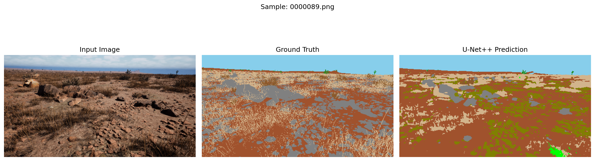
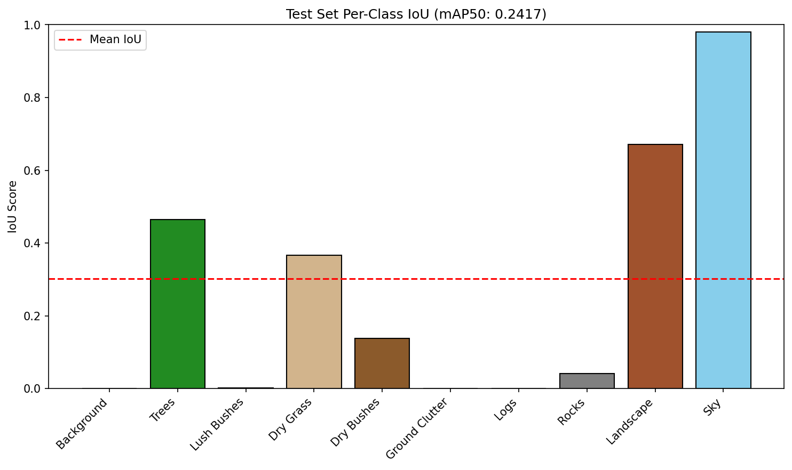

# Offroad Terrain Semantic Segmentation
**Hackathon Project Documentation**

## 1. Project Overview
The objective of this project is to build a robust semantic segmentation model capable of identifying and masking 10 distinct terrain and object classes in offroad driving environments. The final pipeline processes RGB images and outputs 16-bit PNG masks mapped to specific hackathon evaluation values.

### The 10 Classes & Target Values
| Class ID (Model) | Target Value (Hackathon) | Class Name | Color Code |
| :--- | :--- | :--- | :--- |
| 0 | 0 | Background | Black |
| 1 | 100 | Trees | Forest Green |
| 2 | 200 | Lush Bushes | Lime |
| 3 | 300 | Dry Grass | Tan |
| 4 | 500 | Dry Bushes | Brown |
| 5 | 550 | Ground Clutter | Olive |
| 6 | 700 | Logs | Saddle Brown |
| 7 | 800 | Rocks | Gray |
| 8 | 7100 | Landscape | Sienna |
| 9 | 10000 | Sky | Sky Blue |

---

## 2. Model Architecture Evolution
The project underwent a significant architectural pivot to handle extreme class imbalance and capture microscopic terrain details.

### Phase 1: ResNet50 + DeepLabV3+ (Baseline)
* **Concept:** Used ResNet50 as a heavy feature extractor and DeepLabV3+ with Atrous Spatial Pyramid Pooling (ASPP) to capture large, global context.
* **Result:** Achieved 98% accuracy on massive classes (Sky, Landscape) but scored **0.0** on small, fragmented classes (Logs, Ground Clutter, Rocks). The model suffered from the "lazy student" problem, prioritizing large pixel areas over fine details.

### Phase 2: EfficientNet-B3 + U-Net++ (Final)
* **Concept:** Swapped to a surgically precise architecture. 
    * **EfficientNet-B3:** Provides sharper, more complex feature extraction with fewer parameters.
    * **U-Net++:** Replaces simple skip connections with a dense web of nested layers, forcing the model to meticulously reconstruct microscopic edge details that standard models lose.
* **Result:** Successfully recovered detection of small objects, bringing minor class scores off of zero and significantly boosting leaderboard metrics.

---

## 3. Training Strategy & Optimization
To combat the class imbalance and push the model's performance ceiling, several advanced deep learning techniques were implemented:

* **Hybrid Loss Function (Anti-Lazy Setup):**
    * Replaced standard Cross-Entropy Loss with a combination of **Focal Loss** (forces the model to ignore easy classes and heavily penalize errors on difficult, rare classes) and **Dice Loss** (optimizes for exact border overlap).
* **Data Augmentation (Albumentations):**
    * Implemented `HorizontalFlip`, `RandomBrightnessContrast`, and `ShiftScaleRotate` to force the model to learn object structures from multiple angles and lighting conditions.
* **Learning Rate Optimization:**
    * Utilized the `AdamW` optimizer paired with a `CosineAnnealingLR` scheduler to smoothly taper the learning rate over 60 epochs for convergence.
* **Hardware Efficiency:**
    * Implemented PyTorch's Automatic Mixed Precision (`torch.amp`) for FP16 training, allowing for larger batch sizes and faster epoch times on T4 GPUs.

---

## 4. Inference & Evaluation Pipeline
The testing and validation scripts were engineered to maximize the final hackathon score and provide deep visual diagnostics.

* **Test Time Augmentation (TTA):**
    * During inference, the model predicts the standard image, flips the image horizontally, predicts again, un-flips the output, and averages the two confidence maps. This significantly smooths mask borders and reduces anomalies.
* **Automated Diagnostics:**
    * The evaluation script automatically generates a text summary of per-class metrics, a matplotlib bar chart of the scores, and side-by-side visual comparisons (Input vs. Ground Truth vs. U-Net++ Prediction).
* **Submission Formatting:**
    * Includes a Reverse Lookup Table that intercepts the model's standard 0-9 predictions, maps them to the hackathon's required pixel values (e.g., 10000 for Sky), and saves them strictly as 16-bit integers (`np.uint16`) using OpenCV.

---

## Comparision

## Class Metrices

## 5. Final Metrics
Evaluated on the official unseen test dataset using the strict leader-board standards:
* **Final mAP50 Score:** 0.2417
* **Final Mean IoU:** 0.3018# image-segmentation-hackthon
# image-segmentation-hackthon
# image-segmentation-hackthon
# image-segmentation-hackthon
# image-segmentation-hackthon
